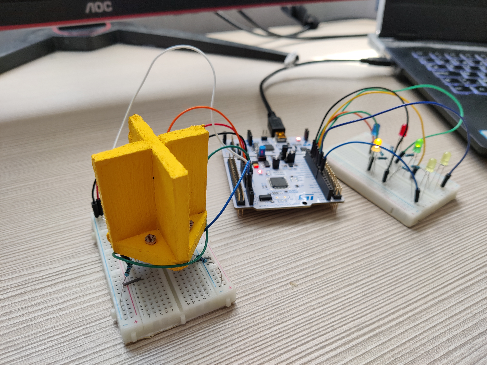
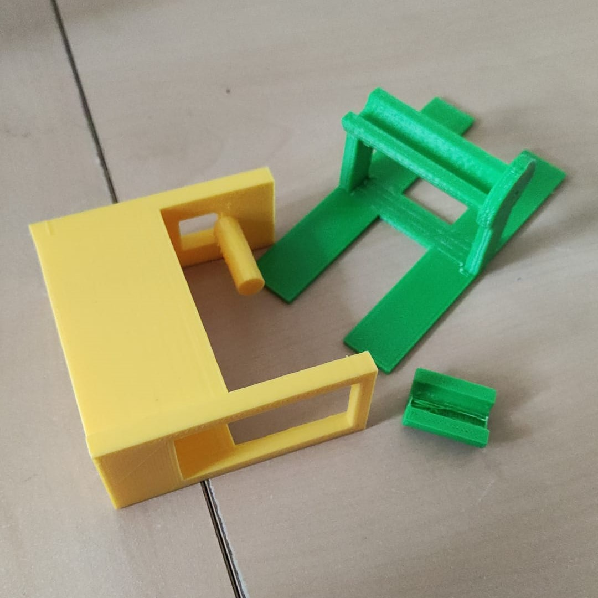
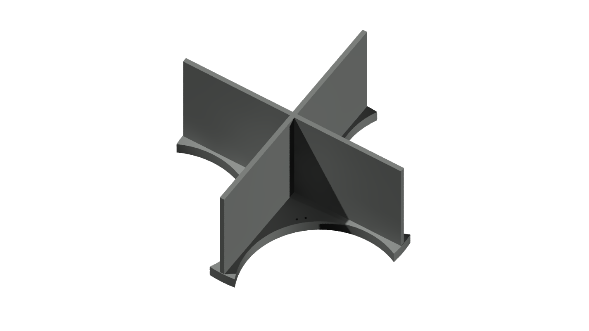
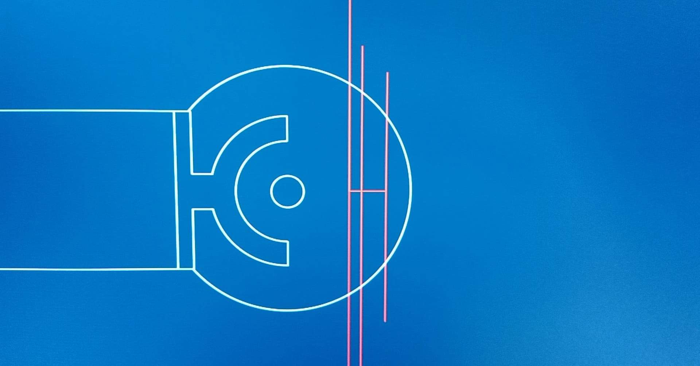
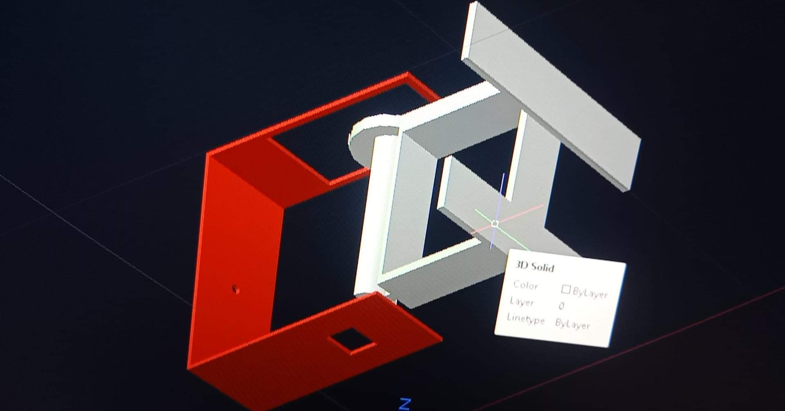

# OnlySolar

## Goals

The goal of our project is to get the maximum efficiency out of a solar panel by rotating it towards the sun with the help of servos and LDRs. The LDRs are isolated from each other so they each individually check a part of the sky. A microcontroller will read the values of those LDRs to control the servos that will aim the solar panel towards the sun. That solar panel will charge a LiPo battery with the help of a solar charger board. The data from the sensors, servos and the solar panel will be sent by the microcontroller to a Raspberry Pi which in turn processes it for viewing this data on a website. This allows us to watch the solar flower without actually physically seeing it.

## Team Members

* Rayan Azzi
* Noah Debaere
* Jens Vanhove
* Maxime Vansteelandt

## Project Analysis

### Hardware

The hardware part of our project is very important, it allows the solar panel to actually move to the sun to charge a battery. Therefore, servos need to be commanded by some kind of sensor that is able to track the sun. A microcontroller makes all of this possible, so this must be programmed too.

Who:

* Jens
* Maxime

Goals:

* Reading the values from the LDRs to detect the source of light
* Writing code for controlling the servos
* Reading values from the voltage and current sensors that read the power of the solar panel and the voltage of the battery.
* Putting all the code in one program with the addition of extra functionality that enables calibration of the SolarFlower
* Creating a temporary model for the proof of concept evaluation
* Creating a final model that puts all the components in a wooden box with the rotating solar panel on top.

Testing LDRs                                                 | Temporary model
:-----------------------------------------------------------:|:-------------------------------------------------:
  |  

### Design - 3D printing

Somehow the servos, LDRs and solar panel need to be connected in a way that everything can move towards the sun. This is a complex challenge, which is why we opted for 3D printing. 3D printing takes a lot of work behind the scenes to draw everything, but the result is exactly what you had in mind.

Who:

* Rayan

Goals:

* Making a sketch of the concept
* Designing the components with AutoCad
* Printing the components

3D printed components                                | Render LDR holder
:--------------------------------------------:|:-------------------------------------------------:
   |  

The complexity of 3D design                               | Designing with AutoCad
:--------------------------------------------:|:-------------------------------------------------:
  |  

### Data Visualization

The goal of data visualization is to watch the solar flower without actually physically seeing it. This is achieved by sending data from the solar panels and servos to a Raspberry Pi which in turn processes it for viewing this data on a website.

Who:

* Rayan
* Noah

Goals:

* Setting up the communication between the Nucleo (microcontroller) and the Raspberry Pi
* Creating a database with InfluxDB and sending all the data
* Visualizing the data in a Grafana dashboard

Final wiring |
:-------------------------------------------------:

