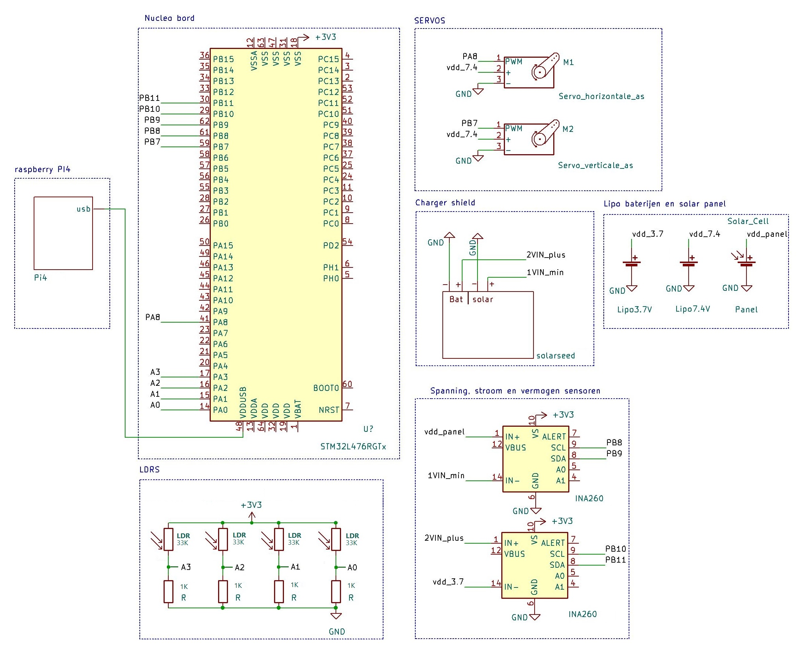

# OnlySolar

[](./actions/workflows/nodejs.yml)


[Link to YouTube video](https://www.youtube.com/watch?v=ZZ_ORB39aEs)

## Team Members

* Rayan Azzi
* Noah Debaere
* Jens Vanhove
* Maxime Vansteelandt

## Materials

* Nucleo LR479-RG
* Raspberry Pi 4
* Solar panel
* 2x Tower Pro MG995 servos
* 4x LDR resistors 33K
* 2x resistors 1K
* 2x INA260 sensors
* 3D printed components
* Solar Charger Shield v2.2
* 1-cell 3.7V Lipo for charging
* 2-cell 7.4V Lipo for powering the servos

## Connecting the hardware



This is the circuit diagram of our project. Everything is connected with cables and jumper wires to a breadboard. Both ends of the LDRs are soldered to a wire inside of an ethernet cable.


This is how it looks from the backside. The servos are connected with the solar panel with the help of the 3D printed components (green and yellow). The solar panel and LDRs are attached to a wooden plate. Make sure that the servos are kept well in place, you don't want them to move around. You can also see the ethernet cable coming from the LDRs and going inside the box. Make sure that enough cable is left over, otherwise the servos could get stuck.

## Setting up the Nucleo

Install the Mbed CLI from [here](https://os.mbed.com/docs/mbed-os/v5.15/quick-start/offline-with-mbed-cli.html)

Execute the following:

```shell
mbed import http://os.mbed.com/users/jensva/code/Mainprogramtest/
```

Install the GNU Arm Embedded Toolchain from [here](https://developer.arm.com/tools-and-software/open-source-software/developer-tools/gnu-toolchain/gnu-rm/downloads)

At the end of the installation, select `Add path to environent table`. However, the mbed-cli installer contains an older version of the toolchain. Remove it from your path. To do so, go to System properties > Advanced > Environment Variables > Edit. Remove it from your Path.

Finally, make sure that the Nucleo is connected to your PC and execute following compilation command:

```shell
mbed compile --target NUCLEO_L476RG --toolchain GCC_ARM --flash
```

The code should compile automatically, and the bin file will be flashed to the Nucleo.

---

## Setting op the Raspberry Pi

When using the

### Setting up the VSCode connection with the Raspberry Pi via SSH

### Running the Python script

---

## Netlify

The Netlify page is linked to a personal GitHub repository that contains all of the code inside of the `website` folder. To link a netlify page to your GitHub, you can follow the steps on [this](https://www.netlify.com/blog/2016/09/29/a-step-by-step-guide-deploying-on-netlify/) page.

 If Netlify is linked, you can change the name of that page. Our page calls "solar-flower.netlify.app. You can visit our page [here](https://solar-flower.netlify.app/)
