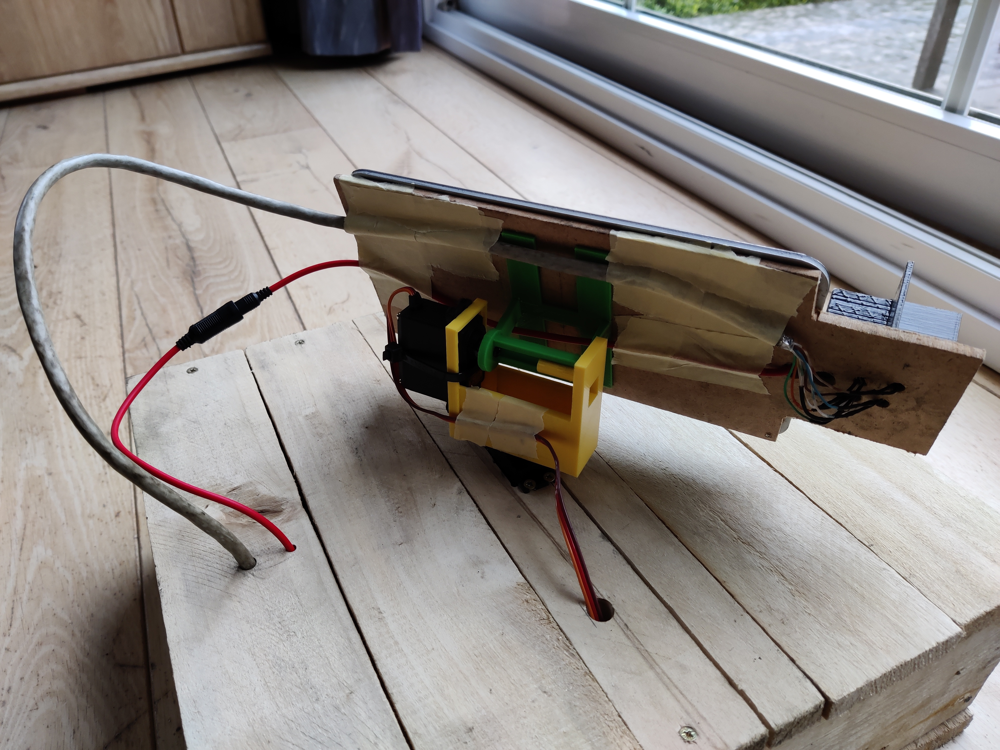
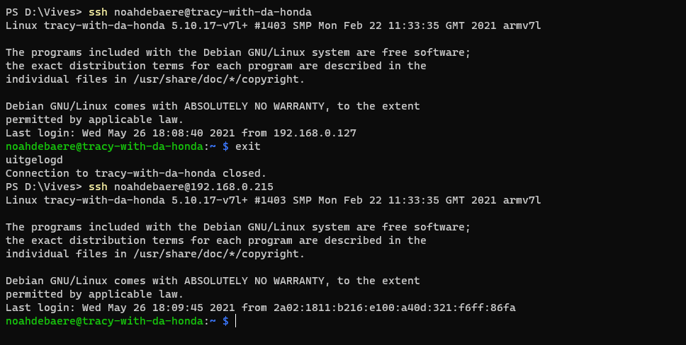
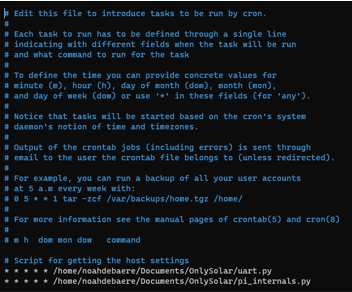

# OnlySolar

[](./actions/workflows/nodejs.yml)


[Link to YouTube video](https://www.youtube.com/watch?v=ZZ_ORB39aEs)

## Team Members

* Rayan Azzi
* Noah Debaere
* Jens Vanhove
* Maxime Vansteelandt

## Materials

* Nucleo LR479-RG
* Raspberry Pi 4
* Solar panel
* 2x Tower Pro MG995 servos
* 4x LDR resistors 33K
* 2x resistors 1K
* 2x INA260 sensors
* 3D printed components
* Solar Charger Shield v2.2
* 1-cell 3.7V Lipo for charging
* 2-cell 7.4V Lipo for powering the servos

## Connecting the hardware


This is the circuit diagram of our project. Everything is connected with cables and jumper wires to a breadboard. Both ends of the LDRs are soldered to a wire inside of an ethernet cable.



This is how it looks from the backside. The servos are connected with the solar panel with the help of the 3D printed components (green and yellow). The solar panel and LDRs are attached to a wooden plate. Make sure that the servos are kept well in place, you don't want them to move around. You can also see the ethernet cable coming from the LDRs and going inside the box. Make sure that enough cable is left over, otherwise the servos could get stuck.

## Setting up the Nucleo

Install the Mbed CLI from [here](https://os.mbed.com/docs/mbed-os/v5.15/quick-start/offline-with-mbed-cli.html)

Execute the following:

```shell
mbed import http://os.mbed.com/users/jensva/code/Mainprogramtest/
```

Install the GNU Arm Embedded Toolchain from [here](https://developer.arm.com/tools-and-software/open-source-software/developer-tools/gnu-toolchain/gnu-rm/downloads)

At the end of the installation, select `Add path to environent table`. However, the mbed-cli installer contains an older version of the toolchain. Remove it from your path. To do so, go to System properties > Advanced > Environment Variables > Edit. Remove it from your Path.

Finally, make sure that the Nucleo is connected to your PC and execute following compilation command:

```shell
mbed compile --target NUCLEO_L476RG --toolchain GCC_ARM --flash
```

The code should compile automatically, and the bin file will be flashed to the Nucleo.

---

## Setting up the Raspberry Pi

First things first in setting up the Raspberry Pi, cloning our repository to find the correct code to copy to your own Pi. To accomplish this you can follow the steps below in a terminal in the desired location on your local computer.

```bash
git clone git@github.com:vives-projectweek-2021/project-repository-onlysolar.git
cd project-repository-onlysolar
cd assets/pi
```

Right now you are located in the correct folder to get started installing the necessary code on your own Raspberry Pi. Secondly let's take a look at what hardware we are going to use.

* 1 Raspberry Pi (this example uses a Pi 4 with Raspbian installed on it). If you don't have Raspbian please follow [this](https://projects.raspberrypi.org/en/projects/raspberry-pi-setting-up) tutorial.

* 1 stable internet connection (either via WiFi or Ethernet)

* Your own computer

### Setting up the VSCode connection with the Raspberry Pi via SSH

When the Pi is up and running, meaning you have the Raspbian OS installed and the Pi is connected to the internet, make sure you are connected to the same network! Otherwise connection via ssh will not be possible (unless you have port forwarding enables for port 22 on your router). Next, make sure you have installed the latest version of Visual Studio Code. You can download the latest version if necessary [here](https://code.visualstudio.com/Download).

From now on you can open VSCode and a terminal to set up the connection with the Pi. First let's check if you can connect to your Pi by typing the commands below in your terminal. You need to know the IP of your Pi or the hostname and user to be able to connect. To find the IP of your Pi, hook it up to a monitor and run the *ifconfig* command in the terminal. When you have all of the above, execute the commands below.

```bash
ssh user@hostname // ssh user@IP-address
```

When connected you should get something like the picture below.



Now we know that our Pi is reachable by our computer we can look to set up the connection through VSCode. Make sure you have [this](https://marketplace.visualstudio.com/items?itemName=ms-vscode-remote.remote-ssh) SSH extension installed and then you can open up Code. Follow the steps below to add an SSH host:

* Press *"Ctrl + Shift + P"* to open the command palette

* Then search for the *Remote-SSH: Connect To Host...* command

* Then select *Add new host*

* Fill in the SSH connection command like you tested out above

* Now VSCode will open on the SSH host and we can start setting up the files.

Create a new folder where you want to save all of the files for the OnlySolar Project. You can just drag the files from your own computer to the directory you just made. Now you have access to change the files where necessary and view the code that was provided by us. Everything is now set up, now it is time to run the Python script regularly.

### Running the Python script

As you can see we have created 2 scripts to run every minute on the Pi. If you run the *solar_measurements.py*, the sensor readings are being sent to the Influx database. When running the *pi_internals.py* all the stats of the Pi will be sent to the Influx DB. The *uart.py* script checks for incoming traffic via the serial USB and writes them to the .txt file.

We can accomplish the above by creating a cron to run every minute and execute the Python scripts. Run the command below to open up the editor and choose the first option.

```bash
crontab -e
```

Add the crons like in the picture below to make sure the scripts can run and save the file.



### Installing Influx DB

At last we still need to install the Influx DB to save all of our data. This can be accomplished by following [this](https://pimylifeup.com/raspberry-pi-influxdb/) tutorial. Make sure to link the correct database in the Python scripts, otherwise the data will be lost in translation!

Now you have set up everything, you can enjoy your own OnlySolar solar charger!

---

## Netlify

The Netlify page is linked to a personal GitHub repository that contains all of the code inside of the `website` folder. To link a netlify page to your GitHub, you can follow the steps on [this](https://www.netlify.com/blog/2016/09/29/a-step-by-step-guide-deploying-on-netlify/) page.

 If Netlify is linked, you can change the name of that page. Our page calls "solar-flower.netlify.app. You can visit our page [here](https://solar-flower.netlify.app/)
